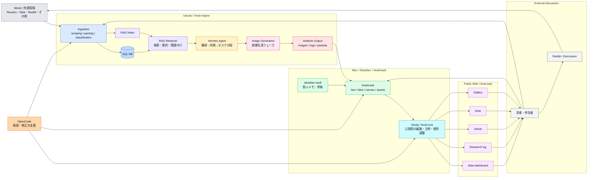

# Feral Research

Public observation system focused on feral animals, displaced pets, abandoned livestock, disaster ecology, and animal migration caused by war, disaster, or human activity.

## Architecture

```
feral/
├── web/       # Public website (HTML/CSS/JS)
├── cms/       # Sanity CMS (Under development)
├── engine/    # Scraping, SQLite, sidecar API, RAG, n8n workflows
└── vault/     # Facts, ideas, canvas, assets (Obsidian-compatible)
```

## Pipeline

```
World → Engine → Database/RAG → Vault → CMS → Public Website → Readers → Next Observation
```

### システムフロー図 (Mermaid)



## Features

### Research Log UI (`web/`)
- **Dual Observation Densities**: Displays short telemetry logs alongside expandable, in-depth editorial readings and generated visual prompts.
- **Unified Navigation**: Structured across Home, Data Dashboard, Research Log, and Gallery.

### Sidecar Engine & API (`engine/`)
- **Dynamic Narrative Building**: Enriches raw disaster data with OpenStreetMap local habitat tags to generate descriptive animal-viewpoint prompts.
- **Structured Database**: Fully tracks disaster occurrences, OSM features, and generated prompts in a unified SQLite repository.
- **GET `/logs` Endpoint**: Serves the 50 most recent log runs formatted for the frontend Research Log view.
- **RAG & Search Support**: Includes API endpoints for retrieving log histories and executing semantic searches on prompt runs.

## Project Status

- **Phases 1-3 (Completed)**: Core UI navigation structure, Research Log frontend rendering logic (supporting short/long logs), SQLite database schema expansion, and Sidecar API setup (ingestion pipeline & logs endpoint) are fully implemented and verified.
- **Next Steps**:
  - Implement and integrate with the Sanity CMS framework (`cms/`).
  - Deploy and test the n8n automation workflows with ComfyUI visual generation.

